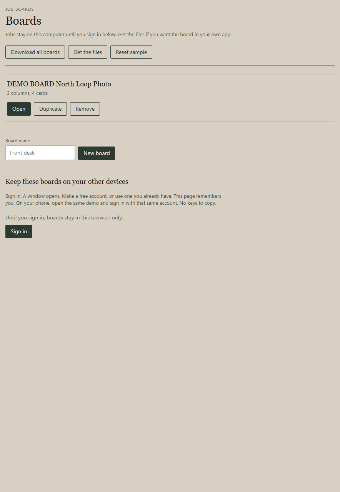
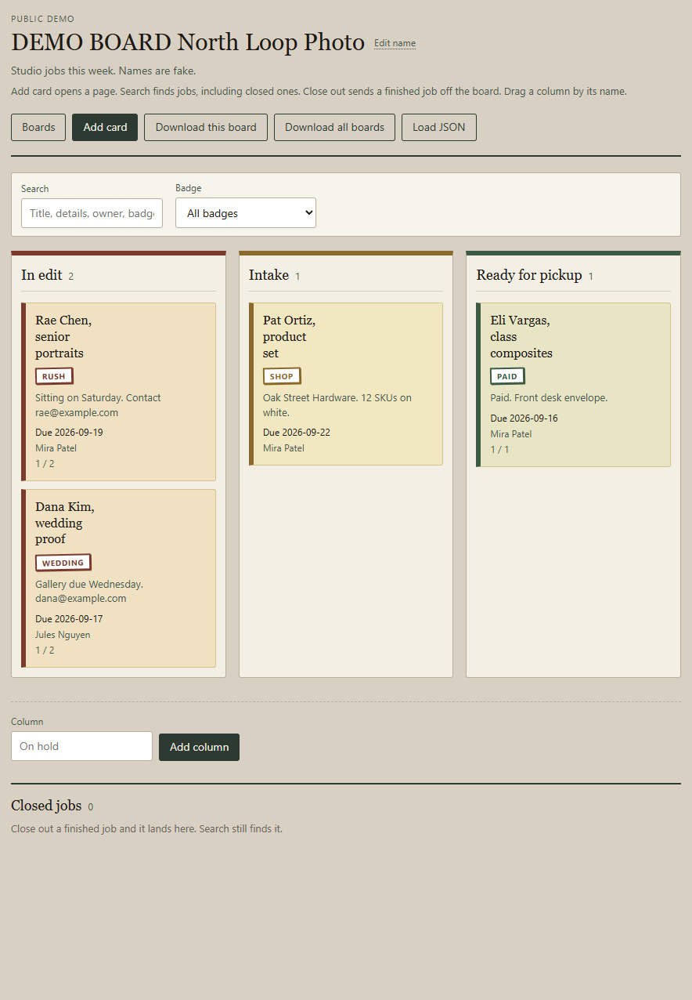
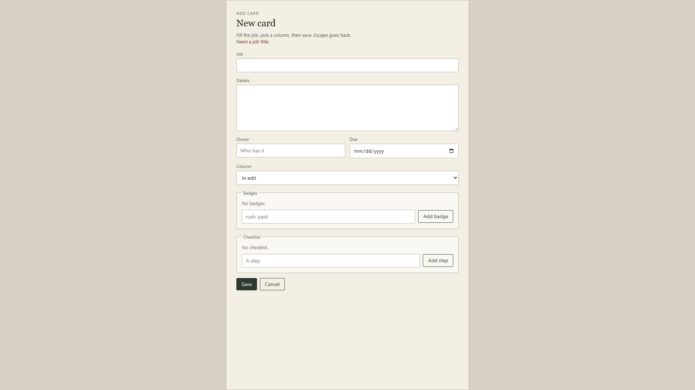

# Kanban board

Columns and cards for jobs that move. Keep more than one board. Add a
card. Drag it. Close it out when it is done. Load and download JSON.
Drop `src/lib/` into a React app you already have.

Try it:
https://aaronlb912.github.io/kanban/

Jobs on that page stay in your browser. Get the files if you want the
board in your own app. To use the same boards on your laptop and phone,
sign in on the Boards page.

The demo starts on a photo studio board (North Loop Photo). Names are
fake. Make a blank board for your own jobs.

## Who it is for

A shop, studio, or small crew that already runs React and needs a job
board on a page. Put your columns and jobs in. Save the JSON.

## What you get

Copy `src/lib/`. That folder is the component.

- `Workspace.jsx` - board list plus the open board
- `Board.jsx` - one board
- `Column.jsx` - one column
- `Card.jsx` - compact card
- `CardPage.jsx` - new card and edit card
- `board.css` - the look
- `board-json.js` - download, load parse, blank template, and move
  helpers
- `cloud-store.js` - optional sign-in save for the demo
- `sample-board.js` - North Loop Photo sample
- `index.js` - the import

No account to try the board. Sign in is optional if you want the same
boards on another device. Nothing sends mail. Boards opens the list. A new board
starts empty with To do, In progress, and Done. Duplicate a board.
You cannot remove the last one. The demo keeps boards after a refresh
(Reset sample on the list if you want North Loop back). Add card in
the header opens a page; pick the column there. Escape cancels.
Search and badge filter find jobs, including closed ones. Rename the
board or a column with Edit. Drag a column by its name. Duplicate a
card from edit. Close out a finished job; it leaves the columns and
sits under Closed jobs. Edit a card for the job (details, owner, due
date, badges, checklist). Badges show on the card. Each column has a
color; cards in that column use it. Drag a card to another column, or
up and down in the same column. Add or remove a column. An empty
board is a real state. Load JSON for one board or all boards.
Download this board or all boards. Old JSON with only `title` and
`note` still loads; `note` becomes `body`. Missing column color
becomes Ink.

## Run the demo

Live: https://aaronlb912.github.io/kanban/

Files: https://github.com/Aaronlb912/kanban

On your machine:

```
npm install
npm start
```

Open http://127.0.0.1:49218/

## Demo







https://github.com/user-attachments/assets/33dfbf07-7748-46e3-8a84-fd586158bc0e

Repo copy: [docs/media/kanban-demo.mp4](docs/media/kanban-demo.mp4)

Voice is Microsoft Andrew Neural. Music is Wallpaper by Kevin MacLeod (incompetech.com), CC BY 3.0.

## Private copy

The public page is a try. Boards stay in that browser until you sign
in.

1. Open the Boards page.
2. Click Sign in. A window opens.
3. Make a free account, or sign in if you already have one.
4. This page remembers you. Edits save to that account.
5. On another device, open the same demo and sign in with that same
   account.

You do not copy a key or an id. Sign out if this computer should stop
saving to the account.

## Use it in your own React app

1. Copy the `src/lib/` folder into your project (for example
   `src/lib/`).
2. Import the workspace (several boards) or the board (one board).

Several boards:

```jsx
import { useState } from 'react'
import { Workspace, sampleWorkspace } from './lib/index.js'

export function Jobs() {
  const [workspace, setWorkspace] = useState(sampleWorkspace)
  return <Workspace value={workspace} onChange={setWorkspace} />
}
```

One board:

```jsx
import { Board, sampleBoard } from './lib/index.js'

export function OneBoard() {
  const [board, setBoard] = useState(sampleBoard)
  return <Board value={board} onChange={setBoard} />
}
```

3. Replace `sampleWorkspace` with your boards. Or start from the
   sample, edit on the page, then Download this board or Download all
   boards. Load JSON brings a saved board or a whole workspace back.

### Props

`Workspace`

- `value` - workspace object (`activeBoardId` plus `boards`)
- `onChange` - function, called with the next workspace
- `onResetSample` - optional. Shows Reset sample on the list
- `cloud`, `cloudNote`, `cloudMiss`, `onSignInCloud`, `onPullCloud`,
  `onForgetCloud` - optional. The demo uses these for Sign in.
  A host app can omit them and save `value` itself.

`Board`

- `value` - one board object
- `onChange` - function, called with the next board
- `onBoards` - optional. Shows a Boards button
- `onLoadWorkspace` - optional. Called when a loaded file is a whole
  workspace
- `onDownloadAll` - optional. Shows Download all boards
- `copyKind` - optional. `"private"` labels the header Private copy.
  Anything else is Public demo.

The demo (`src/App.jsx`) writes the workspace to `localStorage`. If you
sign in, it also saves that JSON to your account. `Workspace` and
`Board` only use `value` / `onChange` for the board data, so a host
app can save however it wants.

## Board JSON

```json
{
  "activeBoardId": "board-north-loop",
  "boards": [{
    "id": "board-north-loop",
    "title": "North Loop Photo",
    "note": "Studio jobs this week.",
    "columns": [
      {
        "id": "intake",
        "title": "Intake",
        "color": "#8a6a2a",
        "cards": [{
          "id": "c-rae",
          "title": "Rae Chen, senior portraits",
          "body": "Sitting on Saturday.",
          "owner": "Mira Patel",
          "due": "2026-09-19",
          "badges": [{ "id": "b-rush", "label": "rush" }],
          "checklist": [{ "id": "ch-1", "text": "Contract signed", "done": true }]
        }]
      }
    ],
    "closed": [{
      "id": "c-sam",
      "title": "Sam Lee, passport photos",
      "body": "Picked up last Tuesday.",
      "owner": "Mira Patel",
      "due": "2026-09-09",
      "closedAt": "2026-09-09",
      "fromColumnId": "ready",
      "fromColumnTitle": "Ready for pickup"
    }]
  }]
}
```

A file that is not JSON, or not a board, shows an error. The open
board stays until a good file loads.

## Make it yours

Change board titles and column titles with Edit. Search jobs. Filter
by badge. Pick a column color (Ink, Ochre, Clay, Moss, Slate, Plum).
Add or remove columns. Edit a card for the job. Edit
`src/lib/board.css`. Card objects are
`{ id, title, body, owner, due, badges, checklist }`. Closed jobs live
on the board as `closed`. A `note` field still loads as `body`. A blank
board is To do / In progress / Done with no cards.
